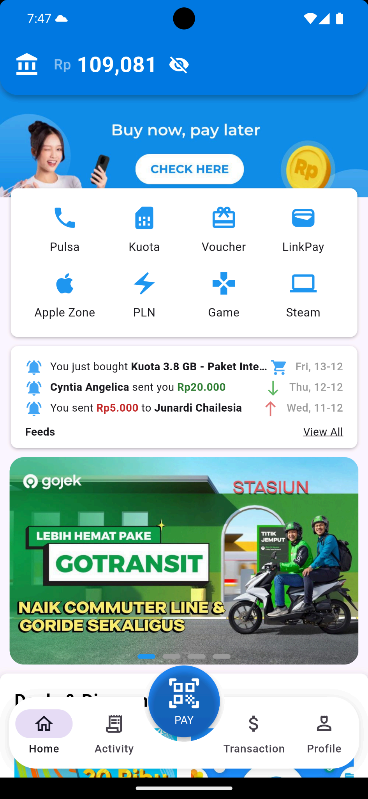

# 💳 T-Cash

A mobile e-wallet application built with **Flutter** for **Android**.  
This project was developed as my **first large-scale mobile programming project**, as part of a **university assignment for the Mobile Programming course**.

<div align=center>
  <a href="img/tcash-welcome.png">
    
  </a>
  <a href="img/tcash-home.png">
    
  </a>
</div>

---

## ✨ Description

T-Cash allows users to manage their digital wallet easily, including:
- Top-up and transfer functionality  
- Transfer to other users via **QR code** scanning
- Profile management  
- Transaction history  
- Track spending with **Income/Expense statistics and graphs**  
- Purchase items such as **mobile pulsa, internet quota, electricity tokens, and Other E-Wallet Top-up**  

---

## 💡 Key Features

- 💰 Display user wallet balance in real-time  
- 📊 Income/Expense statistics with **graphical representation**  
- 🛒 Purchase digital items like **pulsa, internet quota, electricity tokens**, and other goods  
- 🔐 Secure payments with **payment passcode** required for transfers or purchases  
- 💳 Transfer funds to other users via **QR code**  
- 🧾 Transaction history display  
- 👤 Profile management  
- 📱 Clean UI for Android devices  
- ⚡ First major Flutter project to learn mobile programming concepts  

---

## 🧠 What I Learned

Through building T-Cash, I gained practical experience in:
- **State management** in Flutter  
- **Firebase integration** (authentication & database)  
- **QR code generation and scanning**  
- **Navigation and modular code structure** for maintainable apps  

---

## 🧰 Tech Stack


---

## 🚀 Getting Started

### 1️⃣ Clone the repository
```bash
git clone https://github.com/SiEncan/T-Cash.git
cd T-Cash
```

### 2️⃣ Install dependencies
```bash
flutter pub get
```

### 3️⃣ Run on emulator or device
```bash
flutter run
```
Make sure you have Flutter SDK installed and an emulator/device ready.
